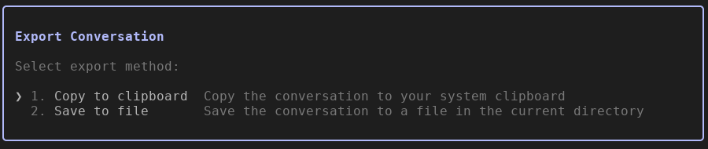

# claude-manual-compact

A CLI tool for compacting text files by splitting them and summarizing the first half with Claude, and keep the second half untouched. 

It's designed to reduce token usage for LLM chat sessions while maintaining context fidelity for the recent conversation.

## Usage

In a Claude Code interactive session, export the current chat by `/export` and choose `Save to file`.



Run the script with the path to the exported file:
```bash
npx https://github.com/thecodecentral/claude-manual-compact <path/chat-session-export.txt>
```

This will product a file in the current directory with the name `claude-compactor-<yyyy-mm-dd-hh-mm-ss>-<4 letter random string>.txt`.

To load the chat session with the compacted content, run:

```bash
cat <output-file> | claude
```


### With Options

```bash
# Split at 60% with 5 lines overlap
./claude-manual-compact my_chat_session.txt --split 60 --overlap 5

# Use specific Claude model
./claude-manual-compact my_chat_session.txt --model claude-opus-4-20250514

# Custom output filename
./claude-manual-compact my_chat_session.txt --output-file my-compacted_chat_session.txt
```

## Development

### Installation

```bash
npm install
```

### CLI Options

- `<file>` - Input file to compact (required)
- `-s, --split <percentage>` - Split percentage 1-100 (default: 50)
- `-o, --overlap <lines>` - Overlap lines 0-99999 (default: 10)
- `-m, --model <model>` - Claude model for summarization
- `--output-file <filename>` - Custom output filename
- `-h, --help` - Show help
- `-V, --version` - Show version

### Example Output

```
📁 Reading file: conversation.txt
📊 File has 200 lines
⚙️  Parameters: split=50%, overlap=10 lines
✂️  Split: Part 1 (lines 1-110), Part 2 (lines 101-200)
🔄 Overlap: 10 lines (101-110)
🤖 Claude is summarizing part 1:

[Claude's streaming response appears here]

✅ Summary completed
💾 Output written to: claude-compactor-2025-07-17-14-23-45-A1B2.txt

🚀 To start a new Claude Code session with the compacted content:
   cat claude-compactor-2025-07-17-14-23-45-A1B2.txt | claude
```

## How It Works

1. **File Splitting**: Reads input file and splits at specified percentage
2. **Overlap Logic**: Both parts share common lines for context preservation
3. **Claude Summarization**: First part is sent to Claude CLI with optimized prompt
4. **Real-time Streaming**: Shows Claude's response as it generates
5. **Content Combination**: Summary + separator + second part = final output

### Overlap Example

For a 100-line file with 50% split and 10 lines overlap:
- **Part 1**: Lines 1-60 (50 + 10 overlap)
- **Part 2**: Lines 51-100 (50 remaining)  
- **Overlap**: Lines 51-60 (shared between both parts)

## Project Structure

```
claude-manual-compactor/
├── claude-manual-compact     # Main executable script
├── src/                      # Modular source code
│   ├── claude-integration.js # Claude CLI interaction & streaming
│   ├── file-splitting.js     # File splitting with overlap logic  
│   └── parameter-validation.js # Input validation functions
├── tests/
│   └── unit/                 # Comprehensive unit tests (61 tests)
├── package.json              # Project configuration
├── jest.config.js            # Jest testing configuration
└── README.md                 # This file
```

## Development

### Technologies Used
- **Node.js** (>=16.0.0) runtime environment
- **Commander.js** for CLI argument parsing and validation
- **Claude CLI** for text summarization (requires separate installation)
- **Jest** for comprehensive unit testing (61 tests)

### Testing

```bash
# Run all tests
npm test

# Run specific test suite
npm test -- tests/unit/test-file-splitting.test.js

# Run tests with coverage
npm run test:coverage

# Run tests in watch mode  
npm run test:watch
```

### Test Coverage
- **File Splitting**: 26 tests covering overlap logic, edge cases, performance
- **Parameter Validation**: 25 tests for input validation and error handling
- **Claude Integration**: 10 tests for CLI interaction and streaming

## Requirements

- **Node.js** >=16.0.0
- **Claude CLI** must be installed and accessible in PATH
- Input files should be text-based (UTF-8 encoding)

## Error Handling

The tool provides clear error messages for:
- File not found or unreadable
- Invalid parameters (split %, overlap count)
- Claude CLI errors or unavailability
- File system permission issues

## License

MIT